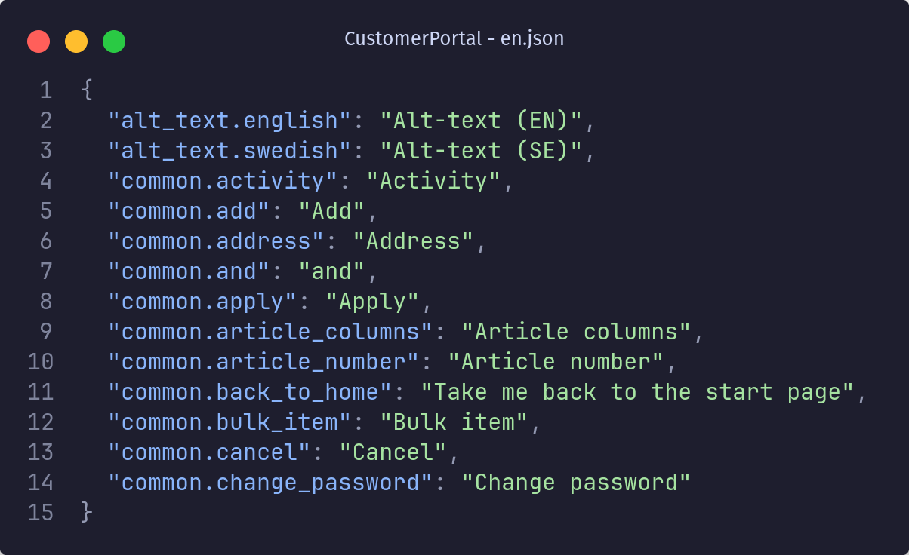

I'm currently working on a React project that uses [react-intl](https://www.npmjs.com/package/react-intl) for translations. We have a lot of translations, and we're adding more every day. Our translation keys and values are manually entered into two JSON files: `en.json` and `sv.json` _(for English and Swedish, respectively)_.



These translations are then used in our React components. Most of the time, we use the `<FormattedMessage />` component from `react-intl` to render the translations:

```jsx
import { FormattedMessage } from "react-intl";

const MyComponent = () => (
  <div>
    <FormattedMessage id="common.change_password" />
  </div>
);
```

# The problem

Unfortunately, it's easy to make mistakes when working like this. For example, you might forget to add a translation for a new string, or you might accidentally use a key that doesn't exist. These mistakes can be hard to catch, especially if you're working on a large project with many translations.

The biggest pain points for us are:

- **Missing translations:** A key is used in the code but there is no translation for it, resulting in the raw key being rendered to the user.
- **Unused translations:** A translation exists but is not used in the code, meaning it's just making the translation file messier and harder to maintain.
- **Key collisions:** Multiple translations have the same key, meaning that one of them will be overwritten by the other.
- **Mismatched files:** The keys in the English and Swedish translation files are not in sync, meaning that a key might exist in one file but not the other.

Finding these mistakes manually is tedious and error-prone. We need a way to automate this process. We need a way to validate our translations.

# Easing the pain

In order to solve these issues _(and build something interesting)_ I began building a tool that could validate our translations, locally and in the CI pipeline.

**Rust** is my language of choice for this project. Primarily because I enjoy working with Rust and have heard good things about the [clap](https://crates.io/crates/clap) crate for building command-line interfaces. But also due to the small binary size, great performance, and the fact that it's easy to compile to multiple platforms.

## Parsing arguments with clap

After installing clap with `cargo add clap --features derive`, you simply define a struct with the arguments you want to parse, and then call the `parse()` method on it:

```rust
/// Handle those damn translations...
#[derive(Parser)]
#[command(version, about)]
struct Args {
    /// Root directory to search from
    #[arg(short, long, default_value = ".")]
    root_dir: PathBuf,
    /// Path to English translation file
    #[arg(short, long)]
    en_file: PathBuf,
    /// Path to Swedish translation file
    #[arg(short, long)]
    sv_file: PathBuf,
}

fn main() {
    let args = Args::parse();

    println!("root_dir: {:?}", args.root_dir);
    println!("en_file: {:?}", args.en_file);
    println!("sv_file: {:?}", args.sv_file);
}
```

Here we are defining three arguments: `root_dir`, `en_file`, and `sv_file`. All three will be parsed as a `PathBuf`, which is a type provided by the standard library for working with file paths. The triple slash `///` comments is used to add documentation and help messages to the CLI.

The `root_dir` argument is optional and has a default value of `.` _(the current directory)_. The `en_file` and `sv_file` arguments are required, and all three arguments can be specified with either a short flag _(e.g. `-r`)_ or a long flag _(e.g. `--root-dir`)_.

This also gives us a nice help message when we run the program with the `--help` flag:

```bash
Handle those damn translations...

Usage: ramilang.exe [OPTIONS] --en-file <EN_FILE> --sv-file <SV_FILE>

Options:
  -r, --root-dir <ROOT_DIR>  Root directory to search from [default: .]
  -e, --en-file <EN_FILE>    Path to English translation file
  -s, --sv-file <SV_FILE>    Path to Swedish translation file
  -h, --help                 Print help
  -V, --version              Print version
```

## Reading the translation files

I created a `TranslationFile` struct to represent a translation file. It contains the path to the file, and a [BTreeMap](https://doc.rust-lang.org/std/collections/struct.BTreeMap.html) of the translation keys and values:

```rust
pub struct TranslationFile {
    pub path: PathBuf,
    pub entries: BTreeMap<String, String>,
}
```

The reason for using `BTreeMap`, a self-balancing tree data structure, is that it keeps the keys sorted without any additional work. Our translation files will now always be sorted alphabetically, making manual inspection easier. This means that writing the entries back to disk, sorted by keys, is as simple as this:

```rust
pub fn write(&self) -> Result<()> {
    let serialized_entries = serde_json::to_string_pretty(&self.entries)?;

    let mut file = File::create(&self.path)?;
    Ok(file.write_all(serialized_entries.as_bytes())?)
}
```

Creating a `TranslationFile` is done by providing a path to the file (`let translation_file = TranslationFile::new(path);`). The implementation of `new()` is a bit more involved, as it needs to read the file, parse the JSON, and check for duplicate keys:

```rust
impl TranslationFile {
    pub fn new(path: PathBuf) -> Result<Self, TranslationFileError> {
        let duplicates = find_key_duplicates(&path);
        if !duplicates.is_empty() {
            return Err(TranslationFileError::DuplicateKeys(path, duplicates));
        }

        let file = std::fs::File::open(&path).expect("Unable to open file");
        let entries = serde_json::from_reader(file).expect("Unable to parse json");

        Ok(Self { path, entries })
    }

    ...
}
```

I am not satisfied with this implementation, as it reads the file twice. Once to check for duplicate keys inside `find_key_duplicates()`, and once inside `serde_json::from_reader()`.

Another issue is that I am looking for duplicates here. This is validation logic that should probably not be part of the `new()` method.

## Checking compatibility between files

The `TranslationFile` struct also has a `is_compatible_with()` method that checks if the keys in the file are compatible with another `TranslationFile`. This is used to check if the keys in the English and Swedish translation files are in sync and that no keys have empty values:

```rust
/// Compare two translation files and return an error if they are not compatible.
///
/// Two translation files are compatible if:
/// - They have the same keys
/// - All keys have a non-empty value
pub fn is_compatible_with(
    &self,
    other: &Self,
) -> Result<(), (Vec<TranslationFileError>, Vec<TranslationFileError>)> {
    let self_errors = self.check_rules(other);
    let other_errors = other.check_rules(self);

    if !self_errors.is_empty() || !other_errors.is_empty() {
        return Err((self_errors, other_errors));
    }

    Ok(())
}

fn check_rules(&self, other: &Self) -> Vec<TranslationFileError> {
    let mut errors = Vec::new();

    for (key, value) in &self.entries {
        // Check matching keys
        if !other.entries.contains_key(key) {
            errors.push(TranslationFileError::MissingKey {
                key: key.clone(),
                missing_in: other.path.clone(),
            });
        // Check non-empty values
        } else if value.is_empty() {
            errors.push(TranslationFileError::EmptyValue(key.to_string()));
        }
    }

    errors
}
```

I would like to improve the rules checking here, as it's not very flexible. For example, it would be nice to be able to specify a list of rules to check _(probably in the form of functions that return a `TranslationFileError`)_, and then have the `check_rules()` method iterate over that list and check each rule.

## Walking the directory tree

The last piece of the puzzle is finding all the places where a translation key is used in the code. In order to do this, we first need to identify all the files that could contain translations.

This is done with the help of the [walkdir](https://crates.io/crates/walkdir) crate, which provides an iterator over all the files in a directory tree:

```rust
fn is_node_modules(entry: &DirEntry) -> bool {
    entry.file_name() == "node_modules"
}

let walker = WalkDir::new(args.root_dir)
    .into_iter()
    // Exclude node_modules
    .filter_entry(|e| !is_node_modules(e))
    // Filter out any non-accessible files
    .filter_map(|e| e.ok());
```

As can be seen above, we are filtering out the `node_modules` directory, as we don't want to check any files in there. The `filter_entry()` function makes the walker not descend into the filtered directories, thereby potentially saving us quite a bit of time _(`node_modules` often contains a ridiculous amount of files and directories)_.

We are also filtering out any files that we don't have access to _(e.g. due to permissions)_. This is done with the `filter_map()` function, which allows us to filter and map at the same time. The `ok()` function converts a `Result` into an `Option`, discarding any errors. Thanks to this, we won't have to deal with any error handling due to inaccessible files inside the loop processing the files.

Now that we have an iterator over all the files, we can narrow it down to only the files that we are interested in. In this case, we are only interested in files with the `.ts` or `.tsx` extension:

```rust
static EXTENSIONS_TO_SEARCH: [&str; 2] = ["ts", "tsx"];

for file in walker.filter(|e| e.path().is_file()) {
    if let Some(ext) = file.path().extension() {
        if EXTENSIONS_TO_SEARCH.contains(&ext.to_str().unwrap()) {
            println!("Doing things with {}", file.path().to_str().unwrap());
        }
    }
}
```

## Finding translation keys in code

To identify the occurrences of each translation key within our TypeScript files, we are leveraging the nom parsing library to navigate through the structure of our code and pinpoint the exact locations where a translation key is used. This operation is essential in ensuring that all keys are correctly implemented and facilitates the detection of any unused keys.

Let's delve into how the Rust code integrates with your TypeScript files to streamline the translation validation process.

### Establishing TypeScript File Structure

We initiate by defining the TSFile struct to represent a TypeScript file. This struct holds both the file itself and its respective path:

```rust
pub struct TSFile {
    pub file: File,
    pub path: PathBuf,
}

pub struct KeyUsage {
    pub key: String,
    pub line: usize,
    pub file_path: PathBuf,
}
```

Within TSFile, we have methods to locate various usage patterns of translation keys in your TypeScript code. Let’s examine each method in detail.

### Finding Specific Usage Patterns

The `find_formatted_message_usages()` method searches for translation keys used in the `<FormattedMessage />` component. It looks for patterns beginning with `<FormattedMessage` followed by `id=` to find the keys:

```rust
pub fn find_formatted_message_usages(&mut self) -> Vec<KeyUsage> {
    self.find_usages("<FormattedMessage", "id=")
}
```

Similarly, the `find_format_message_usages()` method is tuned to find keys used with the `formatMessage()` function. It looks for patterns starting with `formatMessage(` followed by `id:`:

```rust
pub fn find_format_message_usages(&mut self) -> Vec<KeyUsage> {
    self.find_usages("formatMessage(", "id:")
}
```

For other non-standard usage patterns found in the codebase, the `find_misc_usages()` method is used. This method checks various identifiers, which might be customized according to your needs. In the future this should be configurable through a config file:

```rust
pub fn find_misc_usages(&mut self) -> Vec<KeyUsage> {
    let identifiers = [
        "translationId:",
        "translationKey:",
        "transId:",
        "pageTitleId=",
        "titleId=",
    ];

    self.find_usages_multiple_tags(identifiers)
}
```

### Extracting the Translation Keys

The `find_usages()` and `find_usages_multiple_tags()` methods are the core of the key extraction process. They iterate over each line of a file, identifying patterns that signify the use of a translation key and then extracts the key and its usage details (such as the line number and file path).

```rust
fn find_usages(&mut self, opening_tag: &str, id_tag: &str) -> Vec<KeyUsage> {
    ...
    if let Ok((_, key)) = extract_id(&line, id_tag) {
        results.push(KeyUsage {
            key,
            line: line_number + 1,
            file_path: self.path.to_path_buf(),
        });
    }
    ...
}

fn find_usages_multiple_tags(&mut self, tags: [&str; 5]) -> Vec<KeyUsage> {
    ...
    if let Ok((_, key)) = extract_id(&line, tag_str) {
        results.push(KeyUsage {
            key,
            line: line_number + 1,
            file_path: self.path.to_path_buf(),
        });
    }
    ...
}
```

### Key Extraction Utilities

To facilitate key extraction, we use a couple of utility functions: `extract_id()` and `extract_quoted_string()`. These functions utilize [nom](https://github.com/rust-bakery/nom) to navigate to the desired tags and extract the enclosed keys:

```rust
fn extract_id<'a>(input: &'a str, id_tag: &'a str) -> IResult<&'a str, String> {
    let (input, *) = take_until(id_tag)(input)?;
    let (input, *) = tag(id_tag)(input)?;

    let (input, _) = take_until("\"")(input)?;
    let (input, id) = fenced("\"", "\"")(input)?;

    Ok((input, id.to_string()))
}

fn extract_quoted_string(input: &str) -> IResult<&str, String> {
    let (input, *) = take_until("\"")(input)?;
    let (input, id) = fenced("\"", "\"")(input)?;

    Ok((input, id.to_string()))
}
```

I wanted to try out `nom` for this project, as I've seen really cool examples of it being used to parse complex data structures. However, it might be overkill for this use case, and I'm not sure if it's worth the extra complexity. I also think that there might be some skill issues in play here, as `nom` is not the easiest library to work with and this is my first time using it.
